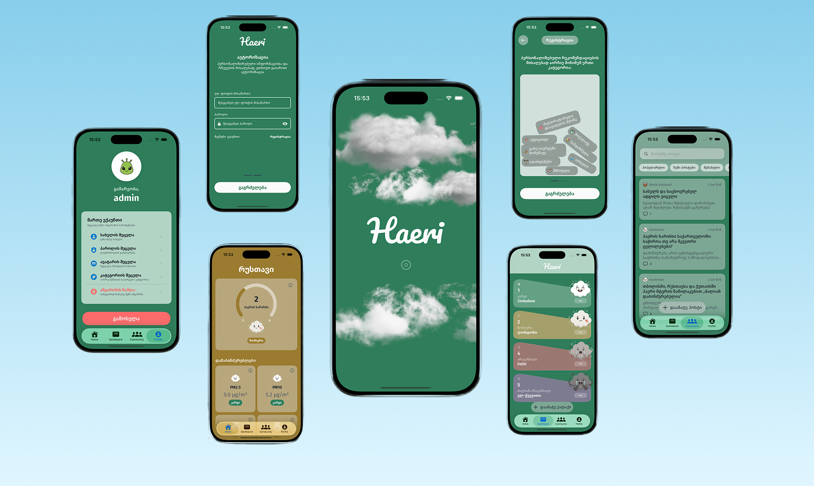
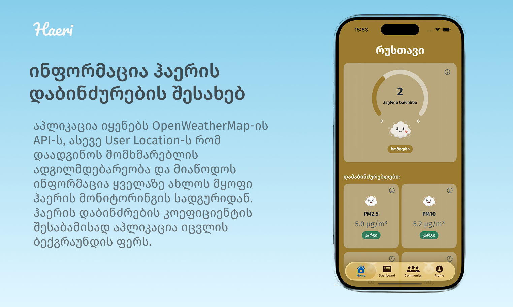
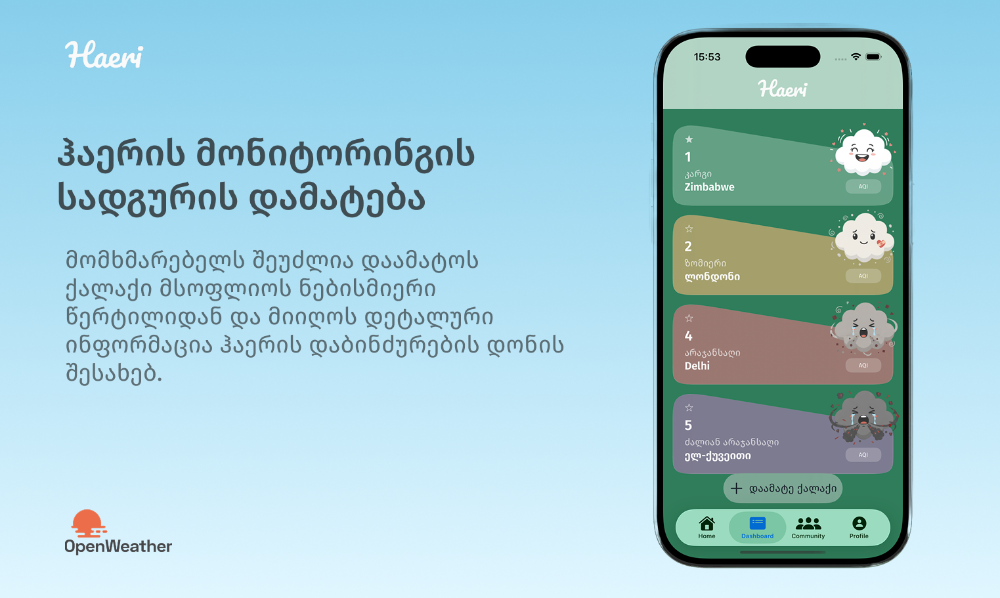
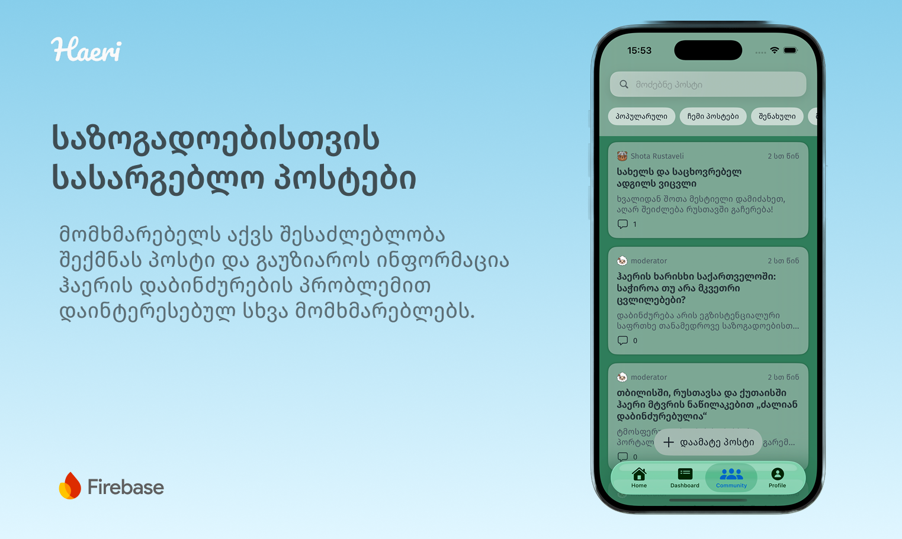

<h1 align="center">
    
</h1>

  <i align="center">ჰაერის ხარისხი მნიშვნელოვანია!</i>

<h4 align="center">
    
    
    
   
    
    
        
    
</h4>

    

## შესავალი

`Haeri` არის აპლიკაცია, რომელიც გვაწვდის ინფორმაციას ჰაერის დაბინძურების შესახებ და გვაძლევს პერსონალიზებულ რჩევებს ჩვენი ჯანმრთელობის დასაცავად.

აპლიკაციიდან მომხმარებელი არა მხოლოდ იღებს ინფორმაციას ჟანგბადის ხარისხის შესახებ, არამედ, ეცნობა თუ რა გავლენა ჰაერში არსებულ ნივთიერებებს ადამიანის ჯანმრთელობაზე.

აპლიკაციის ძირითად სამიზნე აუდიტორიას წარმოადგენენ ორსულები, მშობლები, ხანში შესული ადამიანები, სპორცმენები, რესპირატორული დაავადებებების მქონე და გარე სივრცეში მომუშავე პირები, ასევე აქტივისტები და უბრალოდ ზოგადი ინფორმაციით დაინტერესებული მოქალაქეები. 

`Haeri`-ის მომხმარებლები AI მხარდაჭერის საშუალებით იღებენ მყისიერ, მნიშვნელოვან ინფორმაციას დაბინძურების საფრთხეებზე. ის აერთიანებენ
ადამიანებს, რომლებიიც ზრუნავენ საკუთარი და გარშემომყოფების ჯანმრთელობაზე.

 Features

  

    
&nbsp;
    

    
&nbsp;
    

 

## დეველოპმენტი

აპლიკაცია აგებულია **SwiftUI**-ზე, თუმცა იმ ნაწილებში, სადაც საჭიროა უფრო დეტალური კონტროლი ან legacy კომპონენტები, გამოყენებულია **UIKit**.

<strong>🛠 ტექნიკური სტეკი</strong>

#### 📱 iOS
- **Swift** — SwiftUI & UIKit
- **Combine** — state management და async ნაკადები
- **CoreLocation** — ლოკაციის მონაცემების დამუშავება

#### ☁️ Backend / Services
- **Firebase** — authentication, მონაცემების შენახვა და სერვისები

#### 🌐 External APIs
- **Groq API** — AI რეკომენდაციები
- **OpenWeather API** — ამინდის მონაცემები

<strong>🏗 არქიტექტურა</strong>

- **MVVM + Coordinator** — პასუხისმგებლობების მკაფიო დაყოფა და ნავიგაციის იზოლაცია  
- **Dependency Injection** — ტესტირებადობა და მოქნილი მოდულარობა

## მოთხოვნები
- Xcode 15+
- iOS 17.6 deployment target

## ინსტალაცია
1. დააკლონეთ რეპოზიტორი
2. გახსენით `Haeri.xcodeproj`
3. აირჩიეთ სიმულატორი
4. გაუშვით აპლიკაცია (⌘R)

